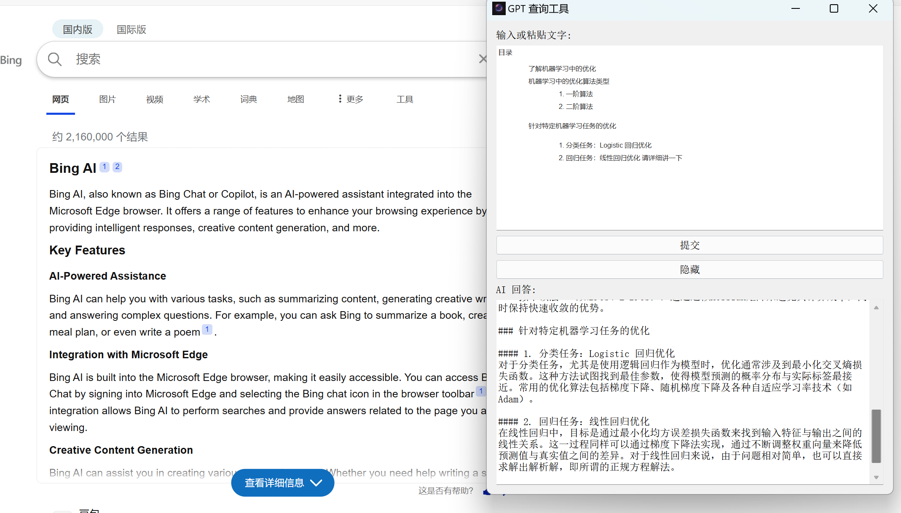
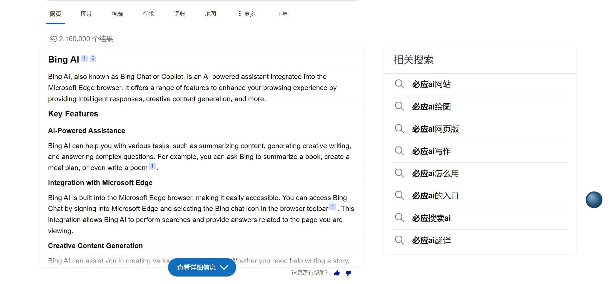
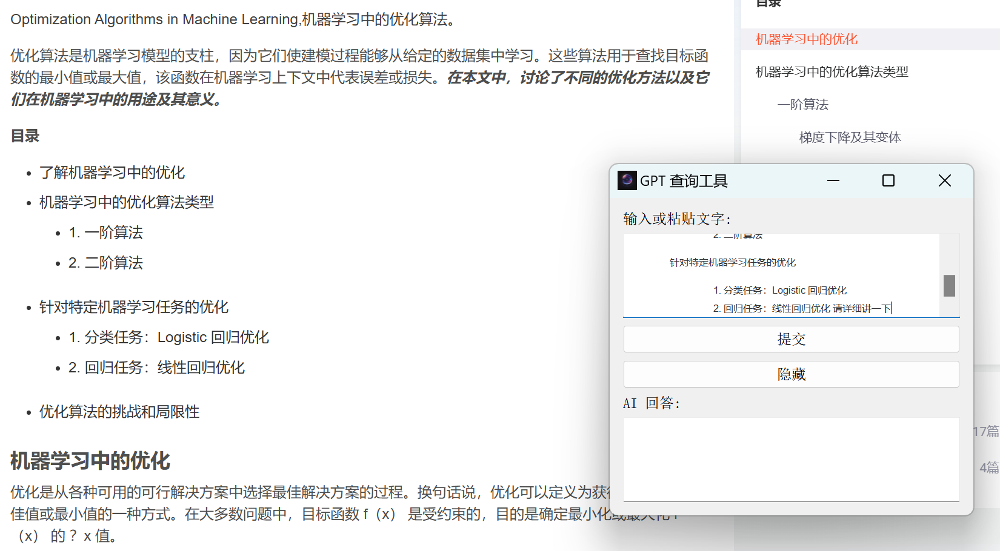
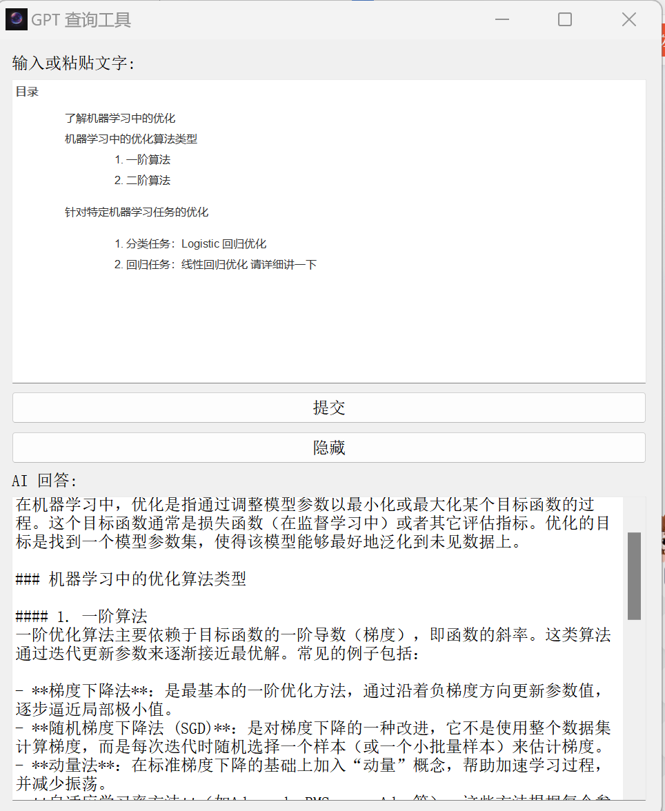

# Smart-Floating-Assistant
One Smart Ball, Covering All Your Needs
## 项目简介

One Smart Ball 是一个高效的大模型交互工具，旨在通过减少在浏览器中进行操作的代价，提供一个便捷的与大模型进行交互的方式。项目支持基本的文本对话回答、通过快捷键复制选中的文字、点击隐藏按钮变成悬浮球、双击悬浮球显示对话框、拖动悬浮球和调整文本框大小等功能。未来，我们计划增加更多实用功能，如快速制定计划表和生成整理好的txt文件等。

## 已实现功能

1. **依托于大模型API支持基本的文本对话回答**
2. **支持通过Ctrl+C，Ctrl+V的功能复制选中的文字**
3. **支持点击隐藏按钮，变成悬浮球，同时双击悬浮球即可显示对话框**
4. **支持拖动悬浮球，调整文本框大小**

## 屏幕截图

- **双击悬浮球之后可以打开文本框的功能**
  

- **悬浮球的功能**
  

- **可以通过Ctrl+C，Ctrl+V的方式快速把文字复制到悬浮球的功能**
  

- **可以通过这个助手快速回答的功能**
  

## 安装

### 环境要求

- Python 3.7 或更高版本
- PyQt5
- pynput
- pyperclip

### 安装步骤

1. 克隆项目仓库：

   ```bash
   git clone https://github.com/yourusername/one-smart-ball.git
   cd one-smart-ball
2.  创建并激活虚拟环境（可选但推荐）：
    python3 -m venv venv
    source venv/bin/activate  # Linux/MacOS
    .\venv\Scripts\activate  # Windows
3.  安装依赖：
    pip install -r requirements.txt
4.  适配API：
    在model_interaction.py中根据自己的大模型API实现def generate_response(prompt)函数
5.  运行程序：
    python smartassistant.py

### 使用方法

启动应用：运行 smartassistant.py启动应用。
输入或选中文字：在任意地方选中文字，使用 Ctrl+C 复制文字。
粘贴文字：应用会自动检测并粘贴复制的文字到输入框中。
提交问题：在输入框中输入问题，点击“提交”按钮获取大模型的回答。
隐藏/显示悬浮球：点击“隐藏”按钮，主窗口会隐藏并显示悬浮球。双击悬浮球可重新显示主窗口。
拖动悬浮球：按住悬浮球并拖动，可以改变悬浮球的位置。
调整文本框大小：按住文本框的边缘并拖动，可以调整文本框的大小。

### 未来计划

在未来的一个月内，我们计划增加以下功能：
1）快速制定计划表：用户可以通过输入任务列表，快速生成计划表。
2）生成整理好的文件内容：用户可以将对话记录导出为整理好的txt文件或者思维导图等形式，方便后续查阅和管理
3）优化界面UI设计
4）增加若干新的功能，通过和本地其他程序和文件进行联动，并提供若干范例
